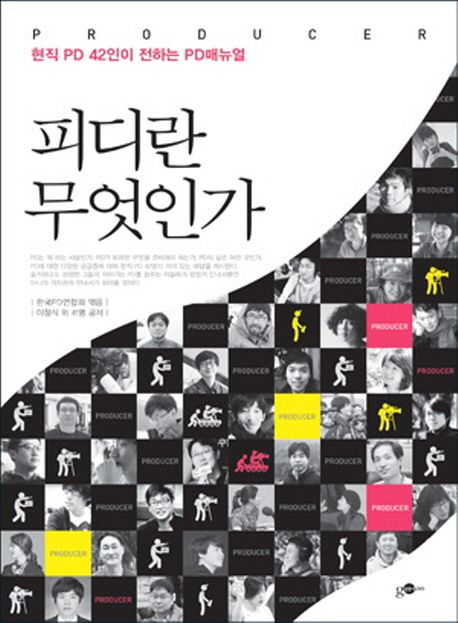

PD 지망생이 흔히 물어보는 것들이 있다. “PD가 되려면 방송이나 언론 관련 학과를 나와야 하나요?” “방송반 활동을 하는 것이 PD에 지원하는 데 경력이 될까요?” “동아리나 학회 회장을 하면 입사할 때 유리할까요?” “세계 각지를 여행한 경험이 면접관들의 관심을 끌 수 있을까요?”

이런 질문들을 받을 때마다 난감하다. 한편으로는 좋아서 하는 것이 아니라 PD가 되기 위해서, 혹은 취업하기 위해서 경험을 쌓겠다는 말로 들려 당황스럽다. 다른 한편으로는 이렇게까지 해야 하는 현실을 실감하며 착잡해진다. 물론 다양한 경험과 활동은 여러 가지로 도움이 된다. 어디로 사라지지 않는 자신만의 경험이 될 테니. 하지만 무슨 활동을 하고, 특정 자리를 맡고, 어디를 가봤다는 사실 자체만으로는 서류 전형에 한 줄 들어가는 것 그 이상도 그 이하도 아니다. 전형이 진행될 수록 ‘스펙’만 있는 지원자들은 분명히 걸러지기 때문이다.

신입사원 공채에 지원하려면 어떻게 준비해야 할까? 이 책의 독자들도 잘 알고 있듯이 왕도는 없다. 오히려 ‘무엇을 어떻게 하는 것이 PD가 되는 데 좋은 경력이다’라고 강조한다면 그건 사기다. 허망하겠지만 이것이 엄연한 사실이다. 그래도 무슨 방법이 있지 않을까, 최소한의 방향이라도 있지 않을까 생각할 텐데, 최근 방송사 채용 시장의 변화를 먼저 알아야 한다.

최근 PD를 채용하는 곳은 지상파, 종합편성채널(이하 종편), 케이블채널(이하 케이블), DMB, 라디오전문채널, 외주제작사, 인터넷 포털 등으로 다양하다. 채용하는 곳이 이전보다 많아졌다고 볼 수 있다. 종편의 등장과 케이블의 시장 확대, 그리고 인터넷을 통한 프로그램 공급을 그 이유로 들 수 있다. 하지만 선발하는 PD의 수가 증가했다고 말하기는 어렵다. PD 지망생들이 최우선으로 지망하는 지상파 방송사들이 신입 공채를 축소하는 추세이고, 공개 채용을 하더라도 경력직의 비중이 신규 채용에 버금갈 정도다. 미디어 시장의 경쟁이 심화됨에 따라 채용을 진행하는 방송사에서는 상당 기간 투자·육성해야 하는 신입보다는, 이른바 ‘즉시 전력감’들을 선호하기 때문이다. 방송사들이 경비 절감과 인력 계획을 이유로 계약직이나 비정규직 PD를 더 선발하는 것 역시 불합리하지만 실제로 일어나는 일이기도 하다.

즉, 과거 지상파 방송사를 주축으로 한 대규모 공채 시스템이 ‘전인적全人的, generalist’ 인재형을 추구했다면 최근에는 ‘전문가專門家, specialist’ 형태의 인재형에 관심을 보이고 있다는 의미다. 물론 이런 변화가 바람직하다고는 할 수 없다. 방송을 제작하는 PD가 특정 분야에 기술적인 우위가 있다고 하더라도 인식의 저변이 넓지 못하면 좋은 프로그램을 만들기 어렵기 때문이다. 하지만 이런 흐름이 있는 것은 분명한 사실이므로 PD라는 직업에 관심을 갖고 준비하는 이들은 현실을 직시할 필요가 있다.

대학을 갓 졸업했거나 다른 분야에서 경력을 쌓은 지원자들은 분명 방송 제작의 기술적인 부분이 경력직에 비해 부족할 수밖에 없다. 하지만 경력직은 사고를 발상하고 적용할 때 제작 관행에서 자유로울 수 없다. 역량이 아무리 뛰어나다고 하더라도 현업에서 일하다 보면 이른바 ‘방송장이’ 마인드에 자연스레 젖는다. 여러 문화에 관심을 갖는다 하더라도 깊어질지언정 넓어지기는 쉽지 않다. 신입 공채를 하는 이유가 바로 여기에 있다. 젊은 감각, 현장에서 생각하지 못하는 새로운 발상, 새로운 사고방식을 찾는 것이다.

**경험, 나만의 내면화가 필요하다**

경험을 내면화하고 제대로 표현해내는 지원자만이 끝까지 남는다. 우리나라 각지를, 세계 여러 나라를 돌아다니며 사람들을 많이 만난 지원자가 있다고 하자. 새로운 것에 대한 호기심이 많고 그에 걸맞은 실행력을 갖춘 지원자는 평가하는 사람들에게는 분명 흥미롭게 보인다.

심지어 현업에 찌들어 있는 이들은 부러워하기까지 한다. 하지만 이런 지원자들과 몇 마디 나눠 보면 실망스러울 때가 한두 번이 아니다. 어디어디를 여행했는지 장소만 늘어놓을 뿐 거기서 자신이 무엇을 느꼈는지, 그것이 현재의 자신에게 무슨 의미가 있는지 말하지 못하기 때문이다.

이렇게 된 데에는 이유가 있다. 이런 지원자들은 경험 자체에 의미를 둔 나머지 자신이 왜 그런 경험을 하려는지 목표가 명확하지 않았기 때문이다. 물론 아무 생각 없이 떠난 여행에서 큰 깨달음을 얻고 오는 경우도 없지는 않다. 하지만 여행의 목적과 의미를 분명히 상정해놓지 않고 떠났을 때는 에펠탑 앞이나 개선문 앞에서 ‘V’자를 그리고 서 있는 사진만 남을 확률이 높다.

목표를 갖고 여행을 떠났다 하더라도, 현지를 돌아다니며 생각을 많이 했다 하더라도 그것의 의미를 정리하지 못하면 그 역시 부족하기는 매한가지다. 여행을 하다 보면 수많은 상념이 지나가고 때로는 평소에 생각하지도 못한 것들을 발견하기도 한다. 그럴 때 뿌듯해하며 나중에 자기 생활에 적용해보리라 다짐한다. 짧든 길든 여행하는 동안 틈틈이 정리해보려 시도하지만 대개 몇 번 메모하거나, 하루이틀의 일기쓰기로 그치고 만다. 여행을 마치고 정리하려고 할 때는 이미 사진만 정리하기도 벅차다. 하지만 그런 상념과 느낌 그리고 아이디어가 정리되지 않는다면 그 여행은 그저 좋은 추억으로만 남을 뿐이다.

이 단계까지만이라도 잘해왔다면 뿌듯해할 자격이 있다. 하지만 종국에 PD에게 요구되는 것은 경험에서 얻은 의미를 잘 표현하고 설명하는 일이다. PD가 세상을 향해 자기 이야기를 들려주는 일을 한다고 생각한다면, 경험의 핵심을 잘 전달하는 능력은 무척 중요하다.

시험이라는 과정을 통해 경험을 의미 있게 재구성하여 재미있게 전달하는 역량을 평가하는 것이다. 평가자들이 지원자의 이야기를 들으며 같은 그림을 그릴 수 있게 말이다.

여행을 예로 들어 말했지만 다른 스펙도 마찬가지다. 동아리 활동에서의 특별한 경험, 영상 제작 경험, 시험 도전, 군대 생활 등에서 자신이 의미를 부여한 한 장면을 포착해서 설명할 수 있어야 한다. 놀랍고 새로운 경험 백 가지보다 하나라도 다른 지원자들과 다르게 의미를 부여하고 표현하는 것이 바로 스펙을 스펙답게 보이게 하는 길이다. 필자를 비롯해 PD들은 대부분 형태만 다를 뿐이지 메모광이라 할 수 있다.

길을 가다가도, 먼 산을 보고 있다가도 바로바로 메모한다. 예전에는 펜과 수첩이나 메모지가 있어야 떠오르는 것들을 기록할 수 있었다. 하지만 디지털 기기를 몸에 지니고 다니면서부터 기록하기가 무척 편리해졌다. 시간이 있으면 메모하고, 필요한 장면은 사진을 찍고, 동영상으로 담고, 녹음까지 할 수 있다. 그러고는 정리해서 차곡차곡 파일에 담아놓는다. 이후 시간은 걸리겠지만 이런 내용들은 구조화되어 프로그램에 나타난다.

**색다른 경험에만 집착하지 마라**

또 하나 강조할 것은 ‘색다른 경험’에만 집착하지 말라는 것이다. 사람은 처한 환경이 모두 다르다. 이제 해외여행은 색다른 경험이 아니다. 너무 많은 지원자가 강조하다 보니 오히려 진부하기까지 하다. 젊은 시절 어떤 이들은 풍족하여 이것저것 해볼 여력이 있지만, 많은 이들은 생활하기도 빠듯할 정도로 분주하게 보낸다. 돈이 없어서 경험하지 못했다고 말하는 것은 비겁한 변명이다. 자신이 살고 있는 지역의 버스를 다 타볼 수도 있고, 도서관에서 춤을 소재로 한 책을 읽고 목록화해볼 수도 있다. 찾고자 하는 인재는 색다른 경험을 한 사람이 아니라 다른 생각을 하는 사람이다. 스펙은 목록의 길이에서 나오는 것이 아니라 지원자의 머리와 가슴과 입에서 나온다.

**시야를 넓히는 플랜 B**

끝으로 지원자들은 ‘플랜 B’를 준비해야 한다. 열심히 준비한 만큼 빨리 현장에서 방송 PD의 길을 걸으면 좋겠지만 그게 그리 쉽지 않다. 현실적으로 대안이 필요하기도 하거니와 다른 분야의 경험이 궁극적으로 PD의 길을 걷는 데 새로운 시각을 열어줄 수 있기 때문이다.

필자 역시 대학시절부터 방송에 관심을 두었지만 졸업 후 치른 시험에서 원하는 결과를 얻지 못했다. 그때 필자 앞에 놓인 선택지는 대학원에 진학하는 것, 다른 데 취업하는 것, 그리고 계속해서 시험을 준비하는 것이었다. 가정형편 때문에 급히 취업해야 하는 것도 사실이었지만, 방송이 아닌 분야에서 경험을 쌓아보는 것도 나쁘지 않을 것 같다는 판단이 들었다. 그래서 꾸준히 관심을 갖고 있던 IT 분야의 작은 회사에 들어갔다. 회사에 다니면서 틈틈이 준비하겠다는 ‘보험’과 같은 것이었다. 막상 일을 하다 보니 배울 게 많았다. 사회인으로서의 기본 자세는 물론이고, 그 분야의 업무 프로세스가 시야를 넓히는 데 상당한 도움이 되었다. 동료나 선후배 PD들 가운데도 짧게는 1년, 길게는 몇 년씩 다른 직업을 거쳐온 이들이 있다. 이들은 프로그램을 기획하거나 제작에 접근할 때 자신만의 독특한 강점을 드러낸다. 남들이 보지 못하는 관점을 짚어내고, 다른 형태의 제작 방식을 도입하기도 한다.

PD 지원자들이 방송사 공채에만 매달리는 것은 그리 바람직한 일은 아니다. 지원자 개인에게도 그렇고 사회적으로도 그렇다. 지원자들이 몇 차례 낙방하면서도 공채에 매달리는 것은 고시 폐인이 된 것과 다름없다. 사회적으로도 젊은 인재들이 몇 명 뽑지도 않는 공채에 몇 년씩 매달려 있다는 것은 큰 낭비다. 영상과 소리를 통해 자기 생각을 표현하는 일을 열망하는 이들이 책상머리에 오랜 시간 머물러 있는 것은 본질에도 맞지 않는다. 스펙을 스펙답게 보이게 하는 지름길은 경험을 나열하는 것이 아닌 새로운 발상에 초점을 맞추는 것임을 잊지 말자.

* 이 글은 2014년 한국PD연합회에서 펴낸 책 'PD란 무엇인가'(김영사)에도 게재되었습니다.